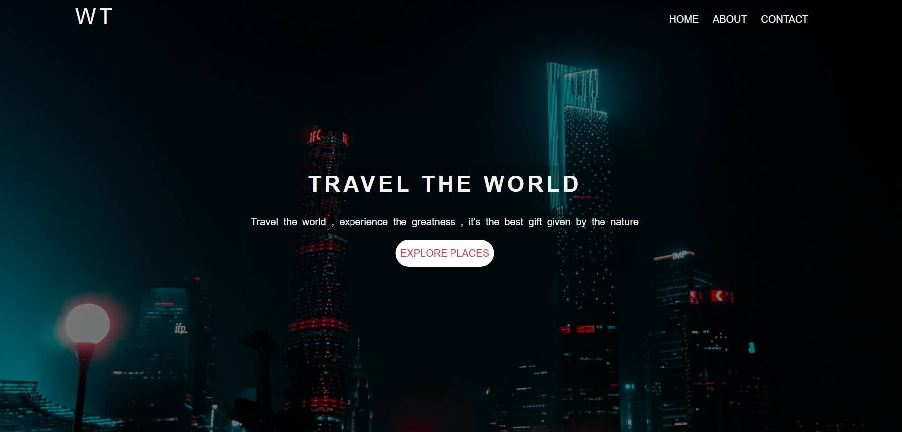
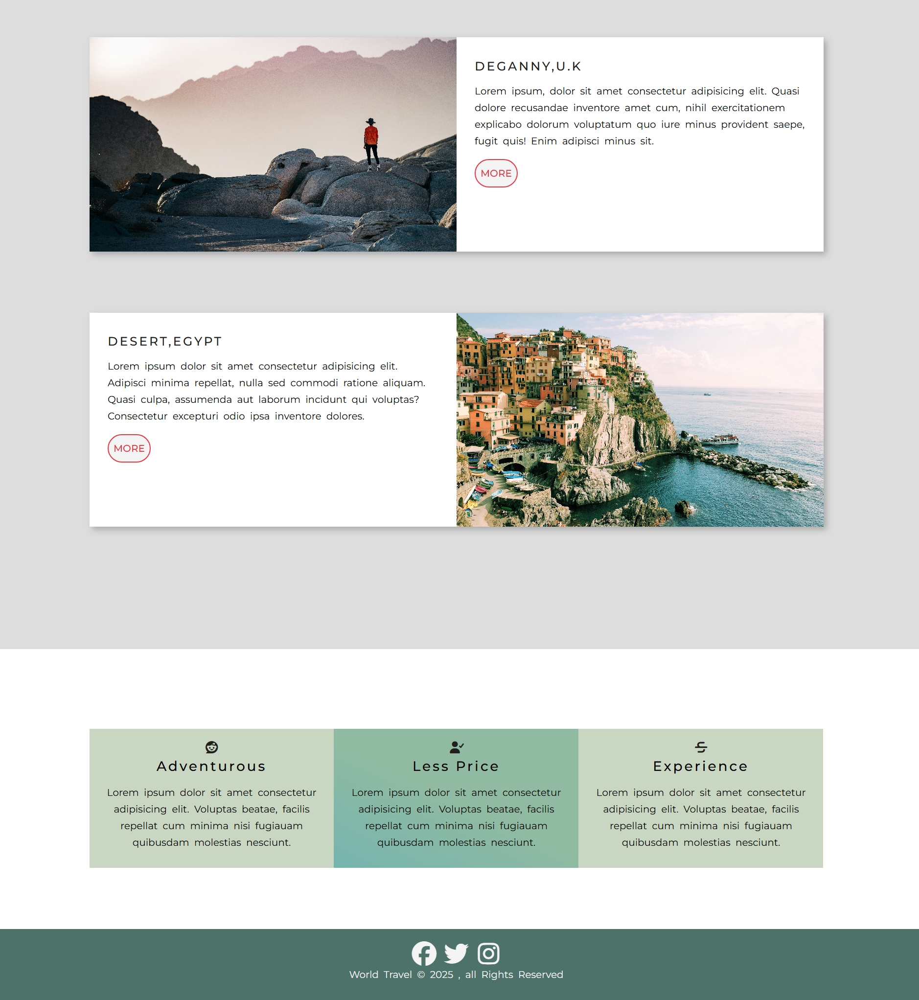
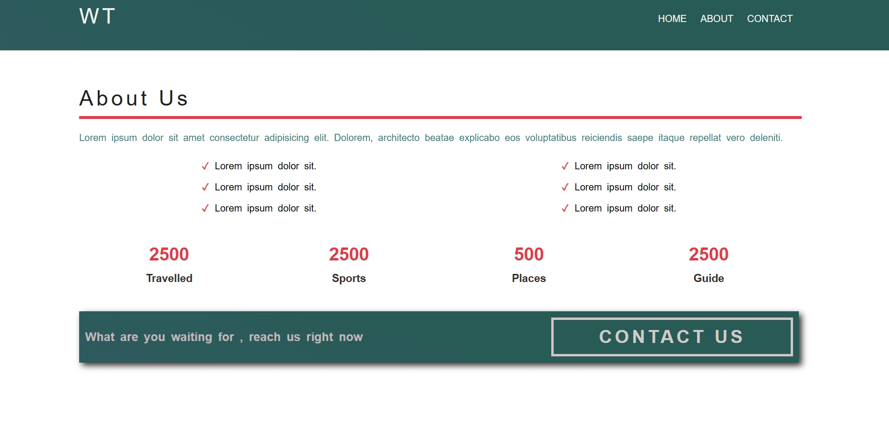
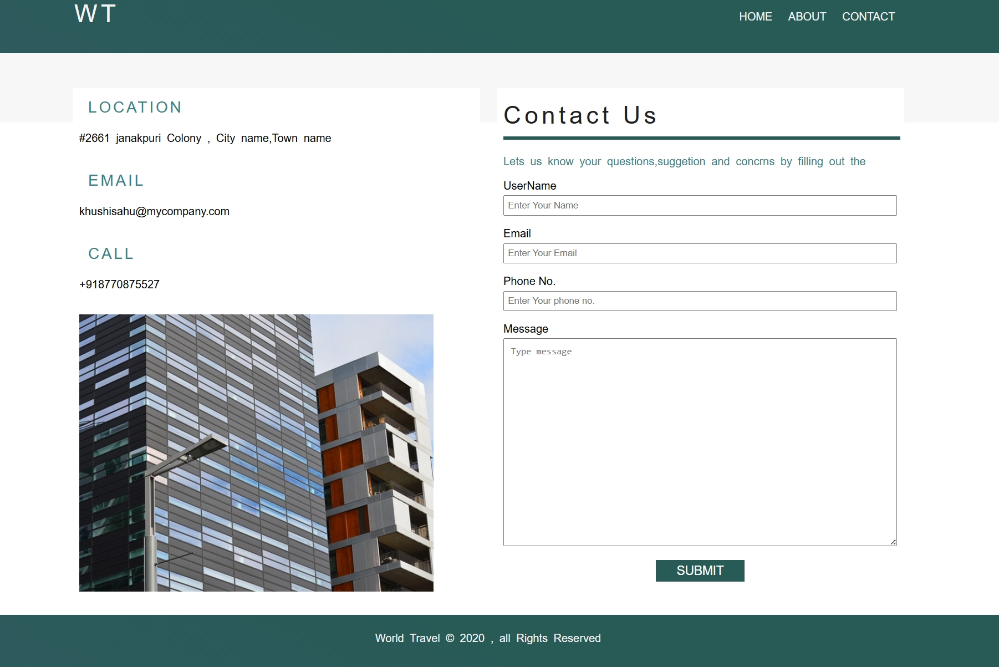
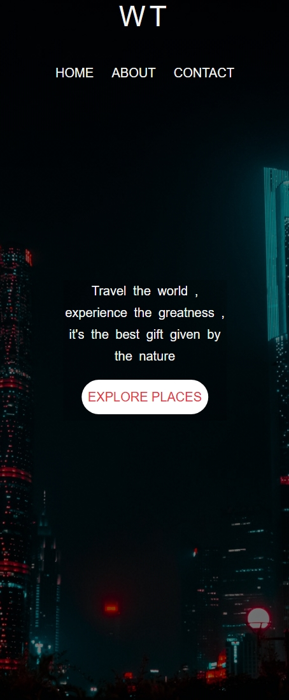

# 🌍 Travel Website (HTML & CSS)


A modern and fully responsive **Travel Website** built using **HTML5 and CSS3**, showcasing clean UI design, structured layouts, and real-world frontend development practices.

---

## 🚀 Live Demo

🌐 **Live Website:** https://khushi-66.github.io/travel-website-html-css/

📂 **GitHub Repository:** https://github.com/khushi-66/travel-website-html-css

---

## 🎥 Live Preview


---

## 📌 Overview

This project demonstrates the development of a **responsive travel website layout** using pure HTML and CSS, focusing on real-world UI/UX design and layout structuring.

It highlights:

* Semantic HTML structure
* Responsive design using media queries
* Layout design using Flexbox & Grid
* Clean and visually appealing UI

---

## 🧠 Key Learnings

* Writing semantic and accessible HTML
* Designing responsive layouts using Flexbox & Grid
* Implementing media queries for different screen sizes
* Structuring clean and maintainable CSS
* Improving UI/UX design understanding
* Managing assets (images, icons, layout spacing)

---

## 📸 Screenshots

### 🏠 Home Section



### 🌍 Destinations Section



### 🎒 Packages Section



### 📞 Contact Section



### 📱 Mobile View



---

## ✨ Features

* 🌍 Attractive travel landing page
* 🧭 Smooth navigation bar
* 🖼️ Hero section with call-to-action
* 🎒 Travel packages display
* 📞 Contact section layout
* 📱 Fully responsive design (mobile + tablet + desktop)
* 🎨 Clean and modern UI

---

## ⚡ Performance & Optimization

* Lightweight and fast loading website
* Optimized layout using Flexbox & Grid
* Minimal and clean CSS structure
* Responsive design for all devices

---

## 🛠️ Tech Stack

| Technology        | Usage          |
| ----------------- | -------------- |
| **HTML5**         | Structure      |
| **CSS3**          | Styling        |
| **Flexbox**       | Layout         |
| **CSS Grid**      | Layout         |
| **Media Queries** | Responsiveness |

---

## 🌐 Deployment

This project is deployed using **GitHub Pages**, making it publicly accessible worldwide.

### 🚀 Deployment Process:

* Uploaded project to GitHub repository
* Enabled GitHub Pages from repository settings
* Selected main branch for deployment
* Generated live public URL

---

## 📂 Project Structure

```bash
travel-website-html-css/
│── index.html
│── style.css
│── screenshots/
│── assets/
│── README.md
```

---

## ⚙️ Installation & Setup

```bash
git clone https://github.com/khushi-66/travel-website-html-css.git
cd travel-website-html-css
```

Open `index.html` in your browser 🚀

---

## 📈 Future Improvements

* 🧠 Add JavaScript for interactivity
* 🛒 Booking functionality
* 🌙 Dark mode support
* 🔗 Backend integration (Node.js / Firebase)
* ⭐ User reviews section

---

## 💡 Recruiter Note

This project demonstrates strong **frontend fundamentals** including:

* Clean HTML structure and semantic design
* Responsive layouts using modern CSS techniques
* Real-world UI/UX implementation without frameworks

It reflects the ability to build **production-ready static websites** with a focus on performance, design, and responsiveness.

---

## 👩‍💻 Author

**Khushi Sahu**
🔗 https://github.com/khushi-66

---

## ⭐ Support

If you like this project, give it a ⭐ on GitHub!
